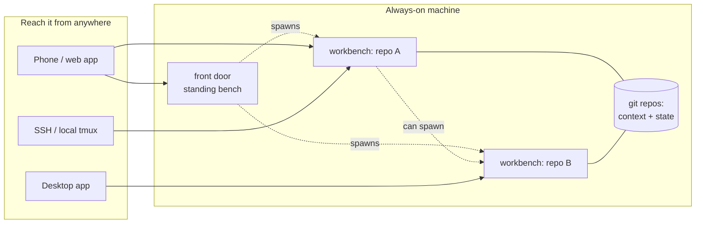

# Wiring it together

*The README builds one remote workbench. This page is the system I run on top of it.*

## What it is

From a phone, I can open a terminal-grade AI workbench on any of my projects, hand it a
piece of work, and put the phone away — without ever logging on to the server it runs on.
Each workbench opens inside its own repo, already knowing that project's context and
rules. The results land as commits, so nothing important lives only in a chat window.

At the basic level, that's four abilities:

- **Open work from anywhere.** One standing session — the *front door* — is always
  running. You open it in the Claude app and ask it to spawn workbenches for you. The
  machine itself becomes invisible: no SSH, no logging on. You talk to sessions;
  sessions manage the machine.
- **Every bench is context-specific.** A workbench opens *in* its repo and reads the
  `CLAUDE.md` at the root before anything else, so it sits down already knowing the
  ground — not a blank chat you have to brief from scratch.
- **Work runs unattended.** A complete seed prompt — the task, its definition of done,
  where the output lands — means the bench needs no supervisor. Kick it off, check in
  later.
- **Nothing is lost when a session ends.** Repos are the memory; sessions are
  disposable. A bench that dies mid-work cost you nothing that was written down.

## How it works



Five pieces, nothing exotic:

1. **An always-on machine.** A cheap VPS is plenty; tmux and the `claude` CLI are the
   whole stack.
2. **tmux** keeps every session alive, detached, through disconnects.
3. **Remote Control** gives each session a `https://claude.ai/code/session_…` link, so
   any of them opens on a phone, in a browser, or in the desktop app.
4. **Git repos** hold the context each bench starts from and the state it leaves behind.
5. **The front door** — one standing bench whose job is to open the others. A phone
   can't run a shell script, so you ask the front door instead: *"spawn an audit bench
   on project-a, seeded with…"*. It runs [`spawn-remote.sh`](spawn-remote.sh) (the
   README's recipe), hands you the new session's link, and you carry on with your
   morning.

### Surviving a reboot

The front door has to *be running*, and a rebooted machine forgets. Give it a way back
up and the system is phone-only permanently — one `@reboot` line in `crontab -e`:

```cron
@reboot sleep 30 && PATH=/usr/local/bin:/usr/bin:/bin:$HOME/.local/bin \
  $HOME/claude-code-workbenches/spawn-remote.sh front-door $HOME/repos \
  'Read CLAUDE.md. You are the front door: you open other workbenches on request.'
```

Notes that matter: cron runs with a minimal `PATH`, so set it (or use full paths to
`tmux`/`claude`); the `sleep 30` gives the network time to come up; and `claude` must
already be logged in on the box (its credentials persist across reboots). After a
reboot, the fresh front-door link is in your session list a minute later.

## Building it well

The pieces above make the system *exist*. These habits are what make it work.

### Every workbench gets a home repo

Durable context lives in git repos, not in chat history. Each area of work is a repo:
the code, the notes, the decisions, the state of play. The `CLAUDE.md` at the root is
the seat: what this repo is, the rules of working in it, where outputs land. Every fresh
session starts already knowing the ground.

```
~/repos/
  project-a/     CLAUDE.md + the work
  project-b/     CLAUDE.md + the work
  notes/         CLAUDE.md + durable context the others reference
```

### The seed prompt carries the work

The seed you pass at spawn is not a greeting; it is the work order. A good one names:

- **the task and its definition of done** — what exists in the world when this is finished;
- **what to read first** — the files that give the session its footing;
- **where the output lands** — a path in the repo, so the result survives the session;
- **what not to do without asking** — the gates (below).

```bash
./spawn-remote.sh audit ~/repos/project-a \
  'Read CLAUDE.md and docs/spec.md first. Audit src/ against the spec and write
   the findings to docs/audit-2026-07.md: one section per gap, worst first.
   Do not change any source files. Commit the report when done.'
```

A bench seeded like that runs to completion without you. A bench seeded with "have a
look at the project" cannot. The difference is the whole game: the seed carries the DNA
of the work, and the bench grows it.

### Skills make it repeatable

The second time you type the same seed, stop and make it a skill. `--plugin-dir` loads a
directory of skills, commands, and persona at spawn, so a bench starts with your
repeatable moves installed:

```bash
tmux send-keys -t myagent \
  'claude --remote-control "myagent" --plugin-dir ~/repos/my-plugin --dangerously-skip-permissions' Enter
```

Keep the plugin in a repo like everything else. Mine accreted one skill at a time, each
born the second or third time I caught myself re-explaining the same job.

### Fan out — and let benches open benches

One bench per piece of work means parallel work is just more benches:

```bash
./spawn-remote.sh triage  ~/repos/project-a 'Read CLAUDE.md. Triage the open issues into docs/triage.md.'
./spawn-remote.sh docs    ~/repos/project-b 'Read CLAUDE.md. Bring README.md up to date with src/.'
./spawn-remote.sh audit   ~/repos/notes     'Read CLAUDE.md. Sweep for TODOs older than a month; list them in review.md.'
```

And because `spawn-remote.sh` is just a command, **a bench can run it** — the front door
is only the standing case of a general move. An agent that hits a sub-task deserving its
own desk spawns a sibling, seeds it, and carries on. You come back to find the work
split sensibly across sessions you didn't open yourself. The only limit is RAM.

### Keep a human on the gates

`--dangerously-skip-permissions` is what makes unattended work possible, and it should
mean exactly this: the agent acts freely *inside* the machine. Anything that *leaves*
the machine stays behind a human yes — sending, publishing, spending, deleting things
that live remotely. Write the gates into each repo's `CLAUDE.md` in plain words, and
mean them:

```
Never send email, post, publish, or push to public remotes without my explicit go.
Draft it, stage it, and stop.
```

Speed belongs to the agent; responsibility stays with you. On a trusted, always-on box
with the gates written down, this arrangement has held for me across months of daily
unattended runs. Without the gates written down, don't run unattended.

### Put work down; pick it back up

Sessions end: the box reboots, you kill one to free RAM, or the work pauses for a week.
Make putting-down explicit. Before a bench closes, have it write a short state note
**into the repo** and commit:

```
Ask the bench: 'Write where we got to into docs/state.md: what's done, what's next,
what's blocked and on whom. Commit it. Then exit.'
```

Re-opening is then a fresh spawn whose seed points at the note:

```bash
./spawn-remote.sh project-a ~/repos/project-a \
  'Read CLAUDE.md, then docs/state.md. Continue from "what is next".'
```

Nothing is lost when a session dies, because nothing durable lived only in the session.

## A worked hour

What it feels like, end to end:

1. Morning, phone: open the front door in the Claude app and ask it to spawn `audit` on
   project-a, seeded with the report it should produce and where to commit it. The seed
   is complete, so the bench needs no supervisor: put the phone away.
2. Midday, laptop: open the audit bench (its link, or `tmux attach -t audit`) — read the
   report it committed, leave two corrections in the chat, detach.
3. It finishes; the report is a commit in the repo, not a scrollback memory. Ask it to
   write `docs/state.md` and exit, or just kill the session — the repo already holds
   everything.
4. Evening: spawn a fresh bench seeded with the report to do the fixes. It opens a
   sibling for a sub-task it judged separable. Both leave commits.

At no point did the *system* depend on a session surviving. The repos are the system;
benches are how it moves.

## Where this goes

This page is deliberately the minimum that works: a front door so the machine
disappears, repos for memory, seeds for intent, skills for repetition, gates for
safety. Past this point, architectures diverge — mine grew into something with its own
vocabulary, and yours will too. Build on the parts that earn their keep and delete the
rest.
