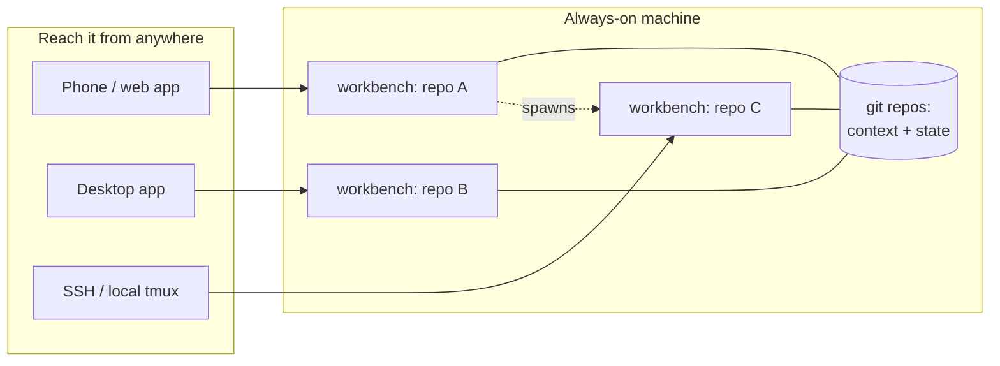

# Wiring it together

*The README gets you one remote workbench. This is how many of them become a working
system. None of it is clever; each piece exists because leaving it out cost me something.*



## 1 · The shape of the thing

A workbench is a terminal where an agent, its tools, and the right context meet to do one
piece of work. The model supplies capability; everything that makes the capability *land*
is in how the bench is set up: what directory it opens in, what it reads first, what it's
told to produce, and what it's allowed to touch.

So the system is not one clever session. It is many cheap ones: one piece of work per
bench, easy to open, safe to leave, easy to re-enter. Sessions are disposable. What they
know and what they made must not be.

## 2 · Every workbench gets a home repo

Durable context lives in git repos, not in chat history. Each area of work I care about
is a repo: the code, the notes, the decisions, the state of play. A workbench opens *in*
its repo (`-c <dir>`), and the first thing the agent meets is a `CLAUDE.md` at the root:
what this repo is, the rules of working in it, where outputs land.

That file is the seat. It means every fresh session starts already knowing the ground,
and nothing important exists only inside a session that might be gone tomorrow.

```
~/repos/
  project-a/     CLAUDE.md + the work
  project-b/     CLAUDE.md + the work
  notes/         CLAUDE.md + durable context the others reference
```

## 3 · The seed prompt carries the work

The seed you pass at spawn is not a greeting; it is the work order. A good one names:

- **the task and its definition of done** — what exists in the world when this is finished;
- **what to read first** — the files that give the session its footing;
- **where the output lands** — a path in the repo, so the result survives the session;
- **what not to do without asking** — the gates (see §6).

```bash
./spawn-remote.sh audit ~/repos/project-a \
  'Read CLAUDE.md and docs/spec.md first. Audit src/ against the spec and write
   the findings to docs/audit-2026-07.md: one section per gap, worst first.
   Do not change any source files. Commit the report when done.'
```

A bench seeded like that can run to completion without you. A bench seeded with "have a
look at the project" cannot. The difference is the whole game: the seed carries the DNA
of the work, and the bench grows it.

## 4 · Skills make it repeatable

The second time you type the same seed, stop and make it a skill. `--plugin-dir` loads a
directory of skills, commands, and persona at spawn, so a bench starts with your
repeatable moves installed:

```bash
tmux send-keys -t myagent \
  'claude --remote-control "myagent" --plugin-dir ~/repos/my-plugin --dangerously-skip-permissions' Enter
```

Keep the plugin in a repo like everything else. Mine accreted one skill at a time, each
born the second or third time I caught myself re-explaining the same job.

## 5 · Fan out — and let benches open benches

One bench per piece of work means parallel work is just more benches:

```bash
./spawn-remote.sh triage  ~/repos/project-a 'Read CLAUDE.md. Triage the open issues into docs/triage.md.'
./spawn-remote.sh docs    ~/repos/project-b 'Read CLAUDE.md. Bring README.md up to date with src/.'
./spawn-remote.sh audit   ~/repos/notes     'Read CLAUDE.md. Sweep for TODOs older than a month; list them in review.md.'
```

And because `spawn-remote.sh` is just a command, **a bench can run it**: an agent that
hits a sub-task deserving its own desk spawns a sibling, seeds it, and carries on. You
come back to find the work split sensibly across sessions you didn't open yourself. The
only limit is RAM.

## 6 · Keep a human on the gates

`--dangerously-skip-permissions` is what makes unattended work possible, and it should
mean exactly this: the agent acts freely *inside* the machine. Anything that *leaves* the
machine stays behind a human yes — sending, publishing, spending, deleting things that
live remotely. Write the gates into each repo's `CLAUDE.md` in plain words, and mean them:

```
Never send email, post, publish, or push to public remotes without my explicit go.
Draft it, stage it, and stop.
```

Speed belongs to the agent; responsibility stays with you. On a trusted, always-on box
with the gates written down, this arrangement has held for me across months of daily
unattended runs. Without the gates written down, don't run unattended.

## 7 · Put work down; pick it back up

Sessions end: the box reboots, you kill one to free RAM, or the work pauses for a week.
The move is to make putting-down explicit. Before a bench closes, have it write a short
state note **into the repo** and commit:

```
Ask the bench: 'Write where we got to into docs/state.md: what's done, what's next,
what's blocked and on whom. Commit it. Then exit.'
```

Re-opening is then a fresh spawn whose seed points at the note:

```bash
./spawn-remote.sh project-a ~/repos/project-a \
  'Read CLAUDE.md, then docs/state.md. Continue from "what is next".'
```

Nothing is lost when a session dies, because nothing durable lived only in the session.

## 8 · The always-on home

Run it all on a machine that never sleeps — a cheap VPS is plenty (tmux and Claude Code
are the whole stack). That is what turns the pattern from a desk tool into a system:
benches keep working when your laptop is shut, and the Remote Control URL means the
phone in your pocket can open, steer, or check any of them from anywhere.

**Keep one standing bench as the front door.** A phone can't run `spawn-remote.sh`
itself, so leave one session always running whose job is to open the others. From the
phone you open *that* session in the Claude app and say "spawn an audit bench on
project-a, seeded with…" — it runs the script (§5), hands you the new session's link,
and you carry on with your morning. Kick off three pieces of work from the sofa; read
the results after lunch.

## 9 · A worked hour

What this actually feels like, end to end:

1. Morning, phone: open the front-door session (§8) in the Claude app and ask it to
   spawn `audit` on project-a, seeded with the report it should produce and where to
   commit it. The seed is complete, so the bench needs no supervisor: put the phone away.
2. Midday, laptop: `tmux attach -t audit` — read the report it committed, leave two
   corrections in the chat, detach.
3. It finishes; the report is a commit in the repo, not a scrollback memory. Ask it to
   write `docs/state.md` and exit, or just kill the session — the repo already holds
   everything.
4. Evening: spawn a fresh bench seeded with the report to do the fixes. It opens a
   sibling for a sub-task it judged separable. Both leave commits.

At no point did the *system* depend on a session surviving. The repos are the system;
benches are how it moves.

## 10 · Where this goes

This file is deliberately the minimum that works: repos for memory, seeds for intent,
skills for repetition, gates for safety, an always-on home so it never stops being
reachable. Past this point, architectures diverge — mine grew into something with its
own vocabulary, and yours will too. Build on the parts that earn their keep and delete
the rest.
